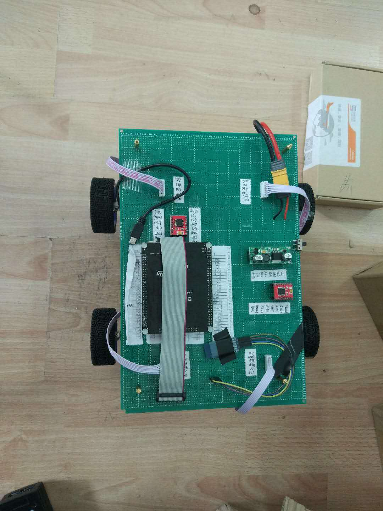

# Four-wheel-drive
This was a four wheel car designed by me manually in April 2018. As for why I did this, because at that time, I wanted to do some research about SLAM and ROS(Robert operating system), but the turtlebot was relative expensive, so I designed this. The four wheel drive can carry raspiberry pi or other embedded elctronic board which can do complex mage recognition operation. The raspiberry pi does not need to control motors directly, it just trasmits informtion to my four wheel drive by usb or serial port, like going ahead 30 centimetres or turning 90 degrees clockwise.

**Hardware**
* DC deceleration motor with photoelectric encoder
* Motor Drive : TB6612FNG
* Controller : STM32F407ZET6
* Battery : Model aircraft batteries
* Under Pan : Acrylic plate

**Pictures**

 

 

 

 